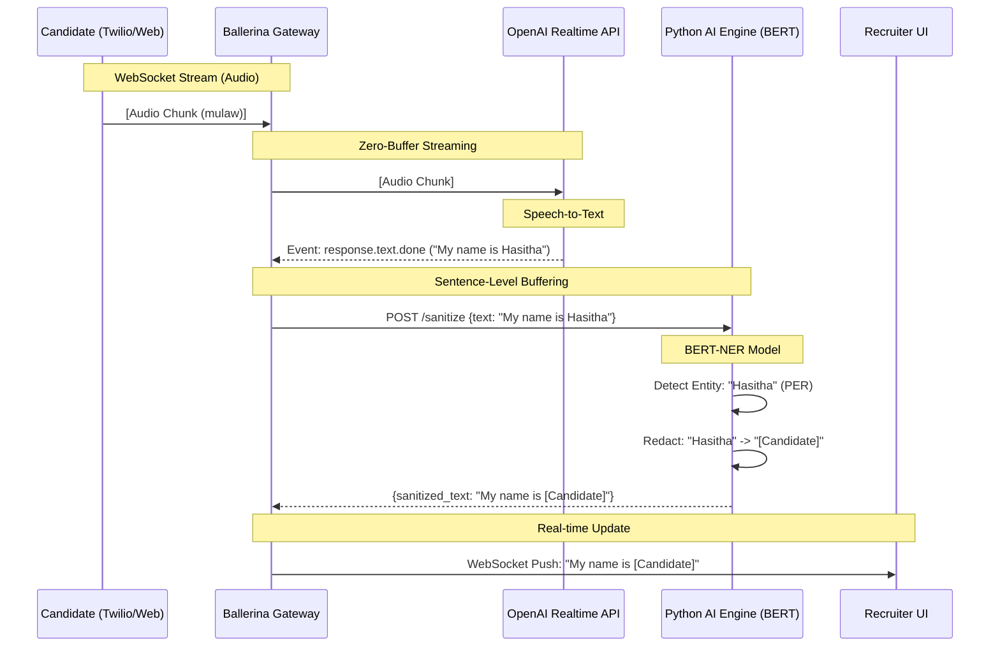

# Voice Architecture: The Bias Firewall

This document details the live voice processing pipeline, also known as the "Bias Firewall" or "The Ballerina Relay".

## Core Concept
The goal of EquiHire is to facilitate a **Blind Interview**. The Recruiter should hear the candidate's answers but **never** their name, location, or other PII (Personally Identifiable Information).

To achieve this in real-time (< 1000ms latency), we use a high-performance orchestration layer.

## The Data Flow

## Component Roles

### 1. Ballerina Gateway (The Orchestrator)
-   **Role**: Traffic Controller.
-   **Why Ballerina?**: It excels at handling multiple asynchronous WebSocket connections (Twilio, OpenAI, Frontend) concurrently.
-   **Key Logic**:
    -   Streams audio blindly to OpenAI (to minimize latency).
    -   **Stops** the text from going to the Recruiter immediately.
    -   Waits for a full sentence event from OpenAI.
    -   Routes the sentence to the Python Firewall.

### 2. OpenAI Realtime API
-   **Role**: Transcription Engine.
-   **Protocol**: WebSocket (`wss://api.openai.com/v1/realtime`).
-   **Responsibility**: Converts raw audio bytes into accurate text with high speed.

### 3. Python AI Engine (The Firewall)
-   **Role**: PII Redactor & Analyst.
-   **Endpoint**: `POST /sanitize`.
-   **Logic**:
    -   Uses a BERT-NER (Named Entity Recognition) model.
    -   Scans text for protected entities (Person, Location, University).
    -   Redacts them *before* returning the text.
    -   (Async) Computes technical competency scores in the background.

### 4. Recruiter UI
-   **Role**: Blind Observer.
-   **Input**: Receives *only* sanitized text.
-   **Security**: Cannot access the raw audio stream or raw transcript.
